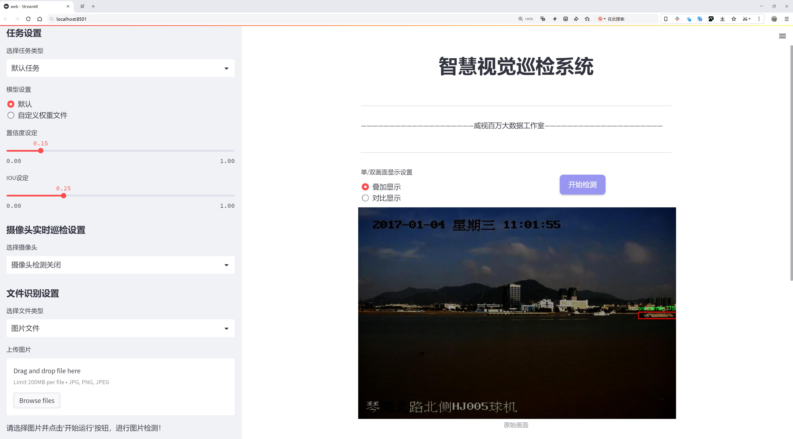
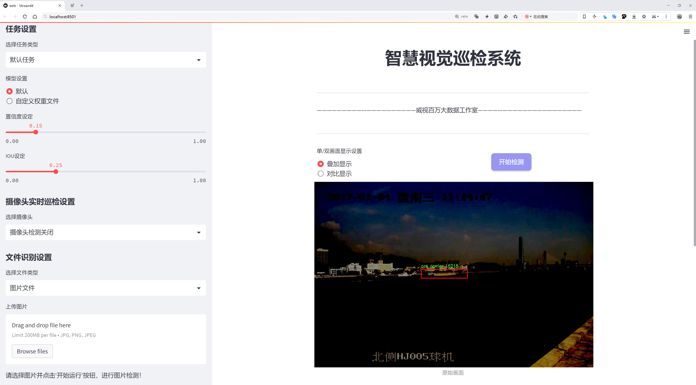
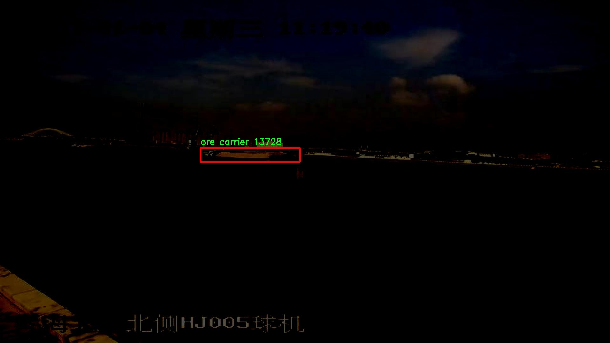
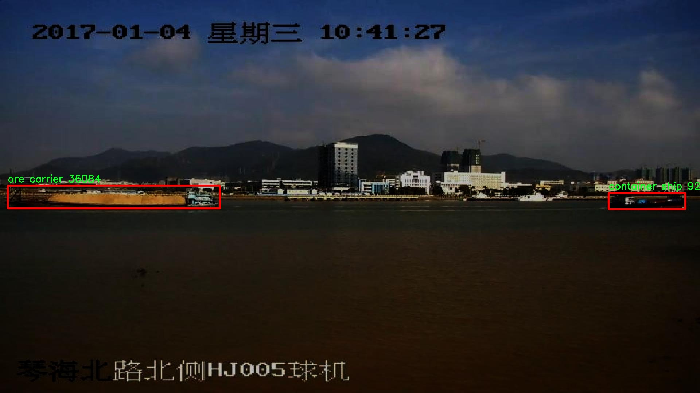
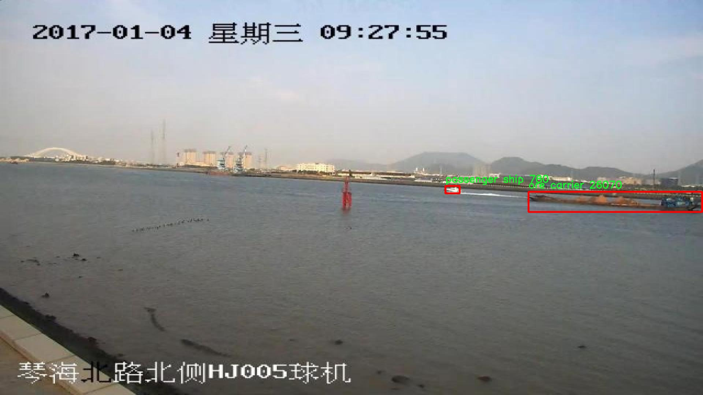
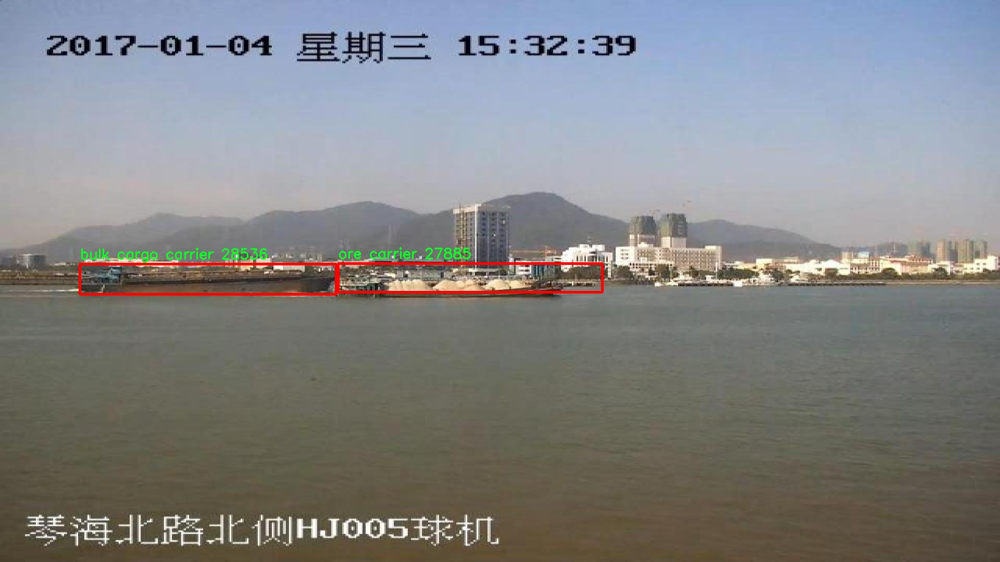
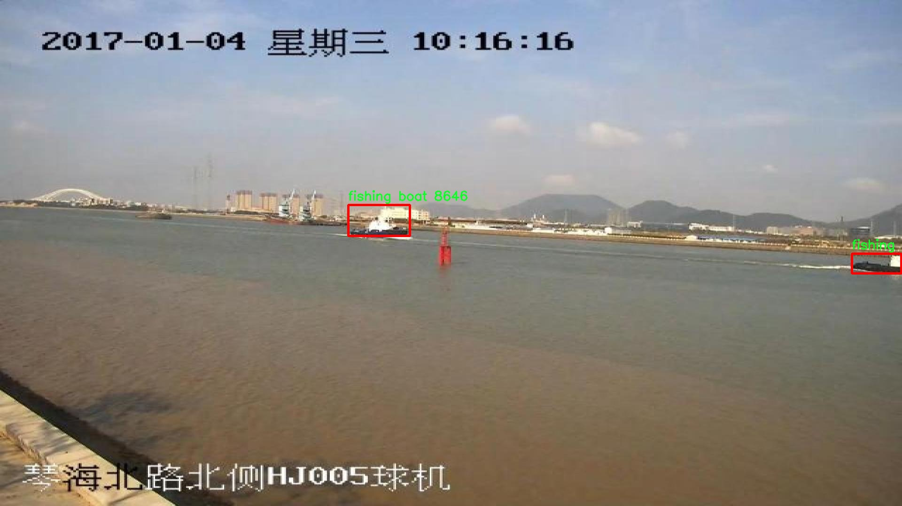

# 船舶检测检测系统源码分享
 # [一条龙教学YOLOV8标注好的数据集一键训练_70+全套改进创新点发刊_Web前端展示]

### 1.研究背景与意义

项目参考[AAAI Association for the Advancement of Artificial Intelligence](https://gitee.com/qunmasj/projects)

项目来源[AACV Association for the Advancement of Computer Vision](https://kdocs.cn/l/cszuIiCKVNis)

研究背景与意义

随着全球贸易的迅速发展，海洋运输作为国际物流的重要组成部分，其效率和安全性愈发受到重视。船舶作为海洋运输的主要载体，其种类繁多，涵盖了散货船、集装箱船、渔船、一般货船、矿石船和客船等多种类型。有效的船舶检测系统不仅能够提高港口管理的效率，还能在海洋安全、环境保护等方面发挥重要作用。因此，开发一种高效、准确的船舶检测系统具有重要的理论价值和实际意义。

在船舶检测领域，计算机视觉技术的迅猛发展为实现自动化检测提供了新的可能性。YOLO（You Only Look Once）系列模型因其快速的检测速度和较高的准确率，已成为目标检测领域的主流方法。尤其是YOLOv8，作为该系列的最新版本，进一步提升了模型的性能，适应了更复杂的检测场景。然而，现有的YOLOv8模型在特定应用场景下仍存在一定的局限性，尤其是在多类别船舶的检测任务中，如何提高模型对不同船舶类型的识别精度和鲁棒性，仍然是一个亟待解决的问题。

本研究旨在基于改进的YOLOv8模型，构建一个高效的船舶检测系统。我们使用的船舶检测数据集包含5800张图像，涵盖了12个类别，包括散货船、集装箱船、渔船、一般货船、矿石船和客船等。这些数据的多样性和丰富性为模型的训练提供了良好的基础，使其能够在不同的海洋环境中进行有效的船舶识别。通过对数据集的深入分析，我们将探索不同船舶类型的特征差异，并针对性地调整YOLOv8模型的结构和参数，以提升其在多类别检测中的表现。

此外，随着深度学习技术的不断进步，模型的可解释性和可迁移性也成为研究的热点。我们将结合迁移学习和数据增强等技术，进一步提升模型在小样本情况下的学习能力。这不仅能够提高模型的泛化能力，还能为实际应用提供更为可靠的技术支持。

本研究的意义不仅在于提升船舶检测的准确性和效率，更在于为港口管理、海洋安全监测等领域提供一种可行的技术解决方案。通过构建高效的船舶检测系统，我们希望能够为海洋运输的智能化、自动化发展贡献一份力量。此外，本研究的成果也将为后续相关领域的研究提供借鉴，推动计算机视觉技术在更多实际应用中的落地。

综上所述，基于改进YOLOv8的船舶检测系统的研究，不仅具有重要的学术价值，也具有广泛的应用前景。通过本研究，我们期待能够为船舶检测技术的发展提供新的思路和方法，为海洋运输的安全与高效贡献力量。

### 2.图片演示






##### 注意：由于此博客编辑较早，上面“2.图片演示”和“3.视频演示”展示的系统图片或者视频可能为老版本，新版本在老版本的基础上升级如下：（实际效果以升级的新版本为准）

  （1）适配了YOLOV8的“目标检测”模型和“实例分割”模型，通过加载相应的权重（.pt）文件即可自适应加载模型。

  （2）支持“图片识别”、“视频识别”、“摄像头实时识别”三种识别模式。

  （3）支持“图片识别”、“视频识别”、“摄像头实时识别”三种识别结果保存导出，解决手动导出（容易卡顿出现爆内存）存在的问题，识别完自动保存结果并导出到tempDir中。

  （4）支持Web前端系统中的标题、背景图等自定义修改，后面提供修改教程。

  另外本项目提供训练的数据集和训练教程,暂不提供权重文件（best.pt）,需要您按照教程进行训练后实现图片演示和Web前端界面演示的效果。

### 3.视频演示

[3.1 视频演示](https://www.bilibili.com/video/BV1dLsYeuEhV/)

### 4.数据集信息展示

##### 4.1 本项目数据集详细数据（类别数＆类别名）

nc: 12
names: ['0', '1', '2', '3', '4', '5', 'bulk cargo carrier', 'container ship', 'fishing boat', 'general cargo ship', 'ore carrier', 'passenger ship']


##### 4.2 本项目数据集信息介绍

数据集信息展示

在本研究中，我们使用了名为“ships_detection”的数据集，以改进YOLOv8的船舶检测系统。该数据集专门针对海洋环境中的各种船舶类型进行了精心设计，旨在提升自动化检测的准确性和效率。数据集包含12个类别，涵盖了从货船到客船的多种船舶类型，具体类别包括：散货船、集装箱船、渔船、一般货船、矿石运输船和客船等。这些类别的多样性不仅反映了海洋运输的复杂性，也为训练模型提供了丰富的样本，确保其在实际应用中的广泛适用性。

“ships_detection”数据集的构建过程经过了严格的筛选和标注，确保每一张图像都准确地反映了船舶的真实特征。数据集中的图像来源于不同的海域和气候条件，涵盖了白天和夜晚的多种场景。这种多样性使得模型在训练过程中能够学习到不同环境下船舶的视觉特征，从而提高其在实际应用中的鲁棒性。数据集的标注工作由经验丰富的海洋工程师和计算机视觉专家共同完成，确保了标注的准确性和一致性。

在类别划分上，数据集不仅包括了常见的船舶类型，如集装箱船和散货船，还涵盖了特定用途的船舶，如渔船和矿石运输船。这种细致的分类有助于模型在进行船舶检测时，能够更好地识别和区分不同类型的船舶，进而提高检测的精度和召回率。尤其是在复杂的海洋环境中，船舶的外观和尺寸可能会因视角和光照条件的变化而有所不同，因此，丰富的类别信息对于模型的学习至关重要。

此外，数据集的规模和样本数量也为模型的训练提供了坚实的基础。通过对大量图像的训练，YOLOv8能够有效地学习到船舶的特征，并在实时检测中表现出色。数据集中的图像经过精心挑选，确保了每个类别都有足够的样本量，以避免模型在某些类别上出现过拟合或欠拟合的情况。这种平衡的样本分布使得模型在面对各种船舶时，能够保持高效的检测能力。

在实际应用中，改进后的YOLOv8船舶检测系统将能够在海洋监测、航运安全和环境保护等领域发挥重要作用。通过对“ships_detection”数据集的深入研究和分析，我们期望能够进一步提升船舶检测的准确性和实时性，为海洋领域的智能化发展贡献力量。总之，数据集“ships_detection”不仅为本研究提供了丰富的训练素材，也为未来的船舶检测技术的发展奠定了坚实的基础。











### 5.全套项目环境部署视频教程（零基础手把手教学）

[5.1 环境部署教程链接（零基础手把手教学）](https://www.ixigua.com/7404473917358506534?logTag=c807d0cbc21c0ef59de5)


[5.2 安装Python虚拟环境创建和依赖库安装视频教程链接（零基础手把手教学）](https://www.ixigua.com/7404474678003106304?logTag=1f1041108cd1f708b01a)

### 6.手把手YOLOV8训练视频教程（零基础小白有手就能学会）

[6.1 手把手YOLOV8训练视频教程（零基础小白有手就能学会）](https://www.ixigua.com/7404477157818401292?logTag=d31a2dfd1983c9668658)

### 7.70+种全套YOLOV8创新点代码加载调参视频教程（一键加载写好的改进模型的配置文件）

[7.1 70+种全套YOLOV8创新点代码加载调参视频教程（一键加载写好的改进模型的配置文件）](https://www.ixigua.com/7404478314661806627?logTag=29066f8288e3f4eea3a4)

### 8.70+种全套YOLOV8创新点原理讲解（非科班也可以轻松写刊发刊，V10版本正在科研待更新）

由于篇幅限制，每个创新点的具体原理讲解就不一一展开，具体见下列网址中的创新点对应子项目的技术原理博客网址【Blog】：


[8.1 70+种全套YOLOV8创新点原理讲解链接](https://gitee.com/qunmasj/good)

### 9.系统功能展示（检测对象为举例，实际内容以本项目数据集为准）

图9.1.系统支持检测结果表格显示

  图9.2.系统支持置信度和IOU阈值手动调节

  图9.3.系统支持自定义加载权重文件best.pt(需要你通过步骤5中训练获得)

  图9.4.系统支持摄像头实时识别

  图9.5.系统支持图片识别

  图9.6.系统支持视频识别

  图9.7.系统支持识别结果文件自动保存

  图9.8.系统支持Excel导出检测结果数据


### 10.原始YOLOV8算法原理

原始YOLOv8算法原理

YOLOv8算法是Ultralytics公司在2023年推出的目标检测模型，它在前几代YOLO系列的基础上进行了显著的改进和创新，旨在提升目标检测的速度和精度。YOLO（You Only Look Once）系列的核心理念是将目标检测任务转化为一个回归问题，通过一个单一的神经网络模型同时预测目标的位置和类别。这种一阶段的检测方式使得YOLO系列在实时性方面表现优异，尤其适合需要快速响应的应用场景。

YOLOv8的网络结构主要由三个部分组成：主干网络（Backbone）、特征增强网络（Neck）和检测头（Head）。在主干网络方面，YOLOv8延续了CSPNet的设计思想，但将YOLOv5中的C3模块替换为C2F模块。C2F模块通过引入更多的并行梯度流分支，能够在保持模型轻量化的同时，获得更丰富的梯度信息。这种设计不仅提升了模型的表达能力，还有效降低了计算延迟，使得YOLOv8在处理复杂场景时表现得更加出色。

在特征增强网络部分，YOLOv8采用了PAN-FPN的思想，旨在通过多层次的特征融合，提升模型对不同尺度目标的检测能力。与YOLOv5相比，YOLOv8在Neck部分去除了多余的卷积连接层，直接对主干网络不同阶段输出的特征进行上采样，这种简化设计不仅提高了特征传递的效率，还减少了模型的复杂性。

YOLOv8在检测头的设计上进行了重大变革，从耦合头（Coupled-Head）转变为解耦头（Decoupled-Head）。在传统的耦合头中，检测和分类任务共享同一个卷积层，这种设计在某些情况下可能导致任务之间的干扰。而YOLOv8通过将分类和回归分为两个独立的分支，使得每个任务能够更加专注于自身的特征提取，从而有效提高了定位精度和分类准确率。此外，YOLOv8采用了Anchor-free的目标检测方法，摒弃了传统的基于锚框的设计。这一创新使得模型不再依赖于预设的锚框，从而简化了训练过程，并提高了对不同尺度和形状目标的适应能力。

在损失函数的设计上，YOLOv8也进行了优化。它在分类分支中使用了二值交叉熵损失（BCELoss），而在边界框回归分支中则采用了分布焦点损失（DFL）和CIoU损失。这种组合旨在使网络更快地聚焦于标签附近的区域，提高预测的准确性。同时，YOLOv8引入了任务对齐学习（Task Alignment Learning），通过引入分类分数和IoU的高次幂乘积作为衡量任务对齐程度的指标，进一步提升了模型在复杂场景下的表现。

在输入处理方面，YOLOv8采用了自适应图片缩放技术，以提高目标检测和推理的速度。默认的输入图像尺寸为640x640，但在实际应用中，YOLOv8能够根据图像的长宽比进行动态调整，尽量减少信息冗余。此外，YOLOv8在训练过程中使用了Mosaic数据增强技术，以增强模型的鲁棒性和泛化能力，但在训练的最后阶段会停止使用Mosaic增强，以避免对数据真实分布的干扰。

通过这些创新和改进，YOLOv8在COCO数据集上的表现得到了显著提升。与之前的YOLO系列模型相比，YOLOv8在检测精度和推理速度上都表现出色，尤其适合于实时目标检测的应用场景。其轻量化的模型结构使得YOLOv8能够在嵌入式设备上高效运行，满足了对实时性和准确性的双重需求。

综上所述，YOLOv8作为YOLO系列的最新版本，凭借其快速、高效的性能和灵活的网络结构，成为了目标检测领域的一个重要里程碑。它不仅继承了YOLO系列的优良传统，还通过一系列创新设计，进一步提升了目标检测的能力，展现了在实际应用中的广泛前景。随着YOLOv8的不断发展和优化，未来在更多复杂场景下的应用将会更加广泛，为目标检测技术的进步提供了新的动力。


### 11.项目核心源码讲解（再也不用担心看不懂代码逻辑）

#### 11.1 code\ultralytics\models\nas\model.py

以下是对给定代码的核心部分进行提炼和详细注释的结果：

```python
# Ultralytics YOLO 🚀, AGPL-3.0 license
"""
YOLO-NAS模型接口。

示例：
    ```python
    from ultralytics import NAS

    model = NAS('yolo_nas_s')
    results = model.predict('ultralytics/assets/bus.jpg')
    ```
"""

from pathlib import Path
import torch
from ultralytics.engine.model import Model
from ultralytics.utils.torch_utils import model_info, smart_inference_mode
from .predict import NASPredictor
from .val import NASValidator

class NAS(Model):
    """
    YOLO NAS模型用于目标检测。

    该类提供YOLO-NAS模型的接口，并扩展了Ultralytics引擎中的`Model`类。
    它旨在通过预训练或自定义训练的YOLO-NAS模型来简化目标检测任务。

    属性：
        model (str): 预训练模型的路径或模型名称。默认为'yolo_nas_s.pt'。

    注意：
        YOLO-NAS模型仅支持预训练模型。请勿提供YAML配置文件。
    """

    def __init__(self, model="yolo_nas_s.pt") -> None:
        """使用提供的或默认的'yolo_nas_s.pt'模型初始化NAS模型。"""
        # 确保提供的模型文件不是YAML格式
        assert Path(model).suffix not in (".yaml", ".yml"), "YOLO-NAS模型仅支持预训练模型。"
        # 调用父类的初始化方法
        super().__init__(model, task="detect")

    @smart_inference_mode()
    def _load(self, weights: str, task: str):
        """加载现有的NAS模型权重，或如果未提供，则创建一个新的NAS模型并使用预训练权重。"""
        import super_gradients

        suffix = Path(weights).suffix
        # 根据权重文件的后缀加载模型
        if suffix == ".pt":
            self.model = torch.load(weights)  # 从.pt文件加载模型
        elif suffix == "":
            self.model = super_gradients.training.models.get(weights, pretrained_weights="coco")  # 获取预训练模型
        
        # 标准化模型属性
        self.model.fuse = lambda verbose=True: self.model  # 融合模型的方法
        self.model.stride = torch.tensor([32])  # 设置模型的步幅
        self.model.names = dict(enumerate(self.model._class_names))  # 设置类别名称
        self.model.is_fused = lambda: False  # 返回模型是否已融合
        self.model.yaml = {}  # 用于信息显示
        self.model.pt_path = weights  # 用于导出模型的路径
        self.model.task = "detect"  # 设置模型任务为检测

    def info(self, detailed=False, verbose=True):
        """
        记录模型信息。

        参数：
            detailed (bool): 是否显示模型的详细信息。
            verbose (bool): 控制输出的详细程度。
        """
        return model_info(self.model, detailed=detailed, verbose=verbose, imgsz=640)

    @property
    def task_map(self):
        """返回一个字典，将任务映射到相应的预测器和验证器类。"""
        return {"detect": {"predictor": NASPredictor, "validator": NASValidator}}
```

### 代码分析
1. **类定义**：`NAS`类继承自`Model`类，专门用于YOLO-NAS模型的目标检测任务。
2. **初始化方法**：在`__init__`方法中，确保模型文件不是YAML格式，并调用父类的初始化方法。
3. **加载模型**：`_load`方法负责加载模型权重，可以从`.pt`文件或通过`super_gradients`库获取预训练模型，并进行标准化设置。
4. **模型信息**：`info`方法用于记录和返回模型的详细信息。
5. **任务映射**：`task_map`属性返回一个字典，映射检测任务到相应的预测器和验证器类。

这些核心部分和注释提供了对YOLO-NAS模型接口的清晰理解，便于后续的使用和扩展。

这个文件是Ultralytics YOLO-NAS模型的接口实现，主要用于目标检测任务。文件中首先引入了一些必要的库，包括`Path`、`torch`以及Ultralytics引擎中的一些模块。文件的开头包含了一个简短的说明，介绍了如何使用YOLO-NAS模型进行预测的示例。

接下来，定义了一个名为`NAS`的类，该类继承自`Model`类。`NAS`类的构造函数接受一个参数`model`，默认值为`yolo_nas_s.pt`，用于指定预训练模型的路径。构造函数中有一个断言，确保传入的模型文件后缀不是`.yaml`或`.yml`，因为YOLO-NAS模型只支持预训练模型，而不支持YAML配置文件。

在`_load`方法中，模型的权重被加载。如果传入的权重文件后缀是`.pt`，则直接使用`torch.load`加载模型；如果没有后缀，则使用`super_gradients`库获取预训练模型。此方法还对模型进行了一些标准化处理，例如设置模型的步幅、类别名称等。

`info`方法用于记录模型的信息，可以选择是否显示详细信息和控制输出的冗长程度。它调用了`model_info`函数来获取模型的相关信息。

最后，`task_map`属性返回一个字典，将任务映射到相应的预测器和验证器类，这里主要支持目标检测任务，分别对应`NASPredictor`和`NASValidator`类。

总体而言，这个文件为YOLO-NAS模型提供了一个清晰的接口，使得用户能够方便地加载模型、进行预测以及获取模型信息。

#### 11.2 code\ultralytics\utils\triton.py

以下是经过简化和注释的核心代码部分：

```python
# 导入必要的库
from typing import List
from urllib.parse import urlsplit
import numpy as np

class TritonRemoteModel:
    """
    与远程Triton推理服务器模型交互的客户端。

    属性:
        endpoint (str): Triton服务器上模型的名称。
        url (str): Triton服务器的URL。
        triton_client: Triton客户端（HTTP或gRPC）。
        InferInput: Triton客户端的输入类。
        InferRequestedOutput: Triton客户端的输出请求类。
        input_formats (List[str]): 模型输入的数据类型。
        np_input_formats (List[type]): 模型输入的numpy数据类型。
        input_names (List[str]): 模型输入的名称。
        output_names (List[str]): 模型输出的名称。
    """

    def __init__(self, url: str, endpoint: str = "", scheme: str = ""):
        """
        初始化TritonRemoteModel。

        参数可以单独提供或从以下格式的'url'参数中解析：
            <scheme>://<netloc>/<endpoint>/<task_name>

        参数:
            url (str): Triton服务器的URL。
            endpoint (str): Triton服务器上模型的名称。
            scheme (str): 通信方案（'http'或'gRPC'）。
        """
        # 如果没有提供endpoint和scheme，则从URL中解析
        if not endpoint and not scheme:
            splits = urlsplit(url)
            endpoint = splits.path.strip("/").split("/")[0]  # 提取模型名称
            scheme = splits.scheme  # 提取通信方案
            url = splits.netloc  # 提取服务器地址

        self.endpoint = endpoint  # 设置模型名称
        self.url = url  # 设置服务器URL

        # 根据通信方案选择Triton客户端
        if scheme == "http":
            import tritonclient.http as client  # 导入HTTP客户端
            self.triton_client = client.InferenceServerClient(url=self.url, verbose=False, ssl=False)
            config = self.triton_client.get_model_config(endpoint)  # 获取模型配置
        else:
            import tritonclient.grpc as client  # 导入gRPC客户端
            self.triton_client = client.InferenceServerClient(url=self.url, verbose=False, ssl=False)
            config = self.triton_client.get_model_config(endpoint, as_json=True)["config"]  # 获取模型配置

        # 按字母顺序排序输出名称
        config["output"] = sorted(config["output"], key=lambda x: x.get("name"))

        # 定义模型属性
        type_map = {"TYPE_FP32": np.float32, "TYPE_FP16": np.float16, "TYPE_UINT8": np.uint8}
        self.InferRequestedOutput = client.InferRequestedOutput  # 设置输出请求类
        self.InferInput = client.InferInput  # 设置输入类
        self.input_formats = [x["data_type"] for x in config["input"]]  # 获取输入数据类型
        self.np_input_formats = [type_map[x] for x in self.input_formats]  # 获取numpy数据类型
        self.input_names = [x["name"] for x in config["input"]]  # 获取输入名称
        self.output_names = [x["name"] for x in config["output"]]  # 获取输出名称

    def __call__(self, *inputs: np.ndarray) -> List[np.ndarray]:
        """
        使用给定的输入调用模型。

        参数:
            *inputs (List[np.ndarray]): 模型的输入数据。

        返回:
            List[np.ndarray]: 模型的输出。
        """
        infer_inputs = []  # 存储推理输入
        input_format = inputs[0].dtype  # 获取输入数据类型
        for i, x in enumerate(inputs):
            # 如果输入数据类型与模型要求不符，则转换数据类型
            if x.dtype != self.np_input_formats[i]:
                x = x.astype(self.np_input_formats[i])
            # 创建InferInput对象并设置数据
            infer_input = self.InferInput(self.input_names[i], [*x.shape], self.input_formats[i].replace("TYPE_", ""))
            infer_input.set_data_from_numpy(x)
            infer_inputs.append(infer_input)  # 添加到推理输入列表

        # 创建输出请求
        infer_outputs = [self.InferRequestedOutput(output_name) for output_name in self.output_names]
        # 调用Triton客户端进行推理
        outputs = self.triton_client.infer(model_name=self.endpoint, inputs=infer_inputs, outputs=infer_outputs)

        # 返回输出结果，转换为原始输入数据类型
        return [outputs.as_numpy(output_name).astype(input_format) for output_name in self.output_names]
```

### 代码说明：
1. **类定义**：`TritonRemoteModel`类用于与Triton推理服务器的模型进行交互。
2. **初始化方法**：`__init__`方法用于设置模型的URL、名称和通信方案，并根据这些信息初始化Triton客户端。
3. **输入输出处理**：`__call__`方法允许用户通过实例化的对象直接调用模型，处理输入数据并返回模型的输出结果。

这个程序文件定义了一个名为 `TritonRemoteModel` 的类，用于与远程的 Triton 推理服务器模型进行交互。该类的主要功能是通过指定的 URL 和模型名称，初始化与 Triton 服务器的连接，并提供一个调用模型的方法。

在类的初始化方法 `__init__` 中，首先会解析传入的 URL，如果没有提供模型名称和通信协议，则从 URL 中提取这些信息。URL 的格式为 `<scheme>://<netloc>/<endpoint>/<task_name>`，其中 `scheme` 表示通信协议（如 HTTP 或 gRPC），`netloc` 是服务器地址，`endpoint` 是模型名称。

根据通信协议的不同，程序会导入相应的 Triton 客户端库（HTTP 或 gRPC），并创建一个 Triton 客户端实例。接着，程序会获取指定模型的配置，并将输出名称按字母顺序排序。然后，程序会定义模型的属性，包括输入和输出的名称、数据类型等。数据类型会被映射到 NumPy 数据类型，以便后续处理。

类中还定义了 `__call__` 方法，使得实例可以像函数一样被调用。该方法接受一个或多个 NumPy 数组作为输入，并将其转换为 Triton 客户端所需的格式。对于每个输入，程序会检查其数据类型是否与模型要求的输入格式一致，如果不一致，则进行类型转换。然后，程序会创建输入对象，并将数据设置到这些对象中。

在准备好输入后，程序会创建输出请求对象，并调用 Triton 客户端的推理方法，传入模型名称、输入和输出信息。最后，方法会返回模型的输出结果，这些结果会被转换为原始输入数据的类型。

总的来说，这个类提供了一种方便的方式来与 Triton 推理服务器进行交互，简化了模型推理的过程。

#### 11.3 ui.py

```python
import sys
import subprocess

def run_script(script_path):
    """
    使用当前 Python 环境运行指定的脚本。

    Args:
        script_path (str): 要运行的脚本路径

    Returns:
        None
    """
    # 获取当前 Python 解释器的路径
    python_path = sys.executable

    # 构建运行命令，使用 streamlit 运行指定的脚本
    command = f'"{python_path}" -m streamlit run "{script_path}"'

    # 执行命令
    result = subprocess.run(command, shell=True)
    # 检查命令执行结果，如果返回码不为0，表示出错
    if result.returncode != 0:
        print("脚本运行出错。")

# 实例化并运行应用
if __name__ == "__main__":
    # 指定要运行的脚本路径
    script_path = "web.py"  # 这里可以直接指定脚本名

    # 运行脚本
    run_script(script_path)
```

### 代码核心部分及注释说明：

1. **导入模块**：
   - `sys`：用于获取当前 Python 解释器的路径。
   - `subprocess`：用于执行外部命令。

2. **`run_script` 函数**：
   - 功能：使用当前 Python 环境运行指定的脚本。
   - 参数：`script_path`，要运行的脚本的路径。
   - 获取当前 Python 解释器的路径，构建命令并执行。
   - 使用 `subprocess.run` 来执行命令，并检查返回码以判断脚本是否成功运行。

3. **主程序部分**：
   - 当脚本作为主程序运行时，指定要运行的脚本路径（这里是 `web.py`）。
   - 调用 `run_script` 函数来执行指定的脚本。

这个程序文件名为 `ui.py`，主要功能是使用当前的 Python 环境来运行一个指定的脚本，具体是通过 Streamlit 来启动一个 Web 应用。

首先，程序导入了必要的模块，包括 `sys`、`os` 和 `subprocess`。其中，`sys` 模块用于访问与 Python 解释器相关的变量和函数，`os` 模块提供了与操作系统交互的功能，而 `subprocess` 模块则用于执行外部命令。

接着，程序从 `QtFusion.path` 模块中导入了 `abs_path` 函数，这个函数的作用是获取文件的绝对路径。

在 `run_script` 函数中，首先定义了一个参数 `script_path`，用于接收要运行的脚本的路径。函数内部首先获取当前 Python 解释器的路径，这通过 `sys.executable` 实现。然后，构建一个命令字符串，使用 `streamlit run` 命令来运行指定的脚本。

接下来，使用 `subprocess.run` 方法执行构建好的命令。如果命令执行的返回码不为 0，表示脚本运行出错，程序会打印出相应的错误信息。

在文件的最后部分，程序通过 `if __name__ == "__main__":` 语句来确保只有在直接运行该文件时才会执行以下代码。这里指定了要运行的脚本路径，调用 `abs_path` 函数获取 `web.py` 的绝对路径，并将其传递给 `run_script` 函数进行执行。

总的来说，这个程序的主要目的是提供一个简单的接口，通过当前的 Python 环境来启动一个基于 Streamlit 的 Web 应用。

#### 11.4 code\ultralytics\solutions\speed_estimation.py

以下是经过简化和注释的核心代码部分：

```python
# 导入必要的库
from collections import defaultdict
from time import time
import cv2
import numpy as np
from ultralytics.utils.checks import check_imshow
from ultralytics.utils.plotting import Annotator, colors

class SpeedEstimator:
    """用于实时视频流中基于物体轨迹估计速度的类。"""

    def __init__(self):
        """初始化速度估计器类，设置默认值。"""
        # 图像和可视化信息
        self.im0 = None  # 当前帧图像
        self.annotator = None  # 注释器，用于绘制
        self.view_img = False  # 是否显示图像

        # 速度计算区域信息
        self.reg_pts = [(20, 400), (1260, 400)]  # 速度计算区域的两个点
        self.region_thickness = 3  # 区域的厚度

        # 预测和跟踪信息
        self.clss = None  # 物体类别
        self.boxes = None  # 物体边界框
        self.trk_ids = None  # 跟踪ID
        self.trk_history = defaultdict(list)  # 跟踪历史

        # 速度估计信息
        self.current_time = 0  # 当前时间
        self.dist_data = {}  # 存储速度数据
        self.trk_previous_times = {}  # 存储上次时间
        self.trk_previous_points = {}  # 存储上次位置

        # 检查环境是否支持imshow
        self.env_check = check_imshow(warn=True)

    def extract_tracks(self, tracks):
        """从跟踪数据中提取结果。"""
        self.boxes = tracks[0].boxes.xyxy.cpu()  # 提取边界框
        self.clss = tracks[0].boxes.cls.cpu().tolist()  # 提取类别
        self.trk_ids = tracks[0].boxes.id.int().cpu().tolist()  # 提取跟踪ID

    def store_track_info(self, track_id, box):
        """存储跟踪数据。"""
        track = self.trk_history[track_id]  # 获取当前跟踪ID的历史轨迹
        # 计算边界框中心点
        bbox_center = (float((box[0] + box[2]) / 2), float((box[1] + box[3]) / 2))
        track.append(bbox_center)  # 将中心点添加到轨迹中

        # 限制轨迹长度为30
        if len(track) > 30:
            track.pop(0)

        # 将轨迹点转换为numpy数组
        self.trk_pts = np.hstack(track).astype(np.int32).reshape((-1, 1, 2))
        return track

    def calculate_speed(self, trk_id, track):
        """计算物体速度。"""
        # 检查物体是否在速度计算区域内
        if not self.reg_pts[0][0] < track[-1][0] < self.reg_pts[1][0]:
            return

        # 判断物体的运动方向
        if self.reg_pts[1][1] - 10 < track[-1][1] < self.reg_pts[1][1] + 10:
            direction = "known"
        elif self.reg_pts[0][1] - 10 < track[-1][1] < self.reg_pts[0][1] + 10:
            direction = "known"
        else:
            direction = "unknown"

        # 计算速度
        if self.trk_previous_times[trk_id] != 0 and direction != "unknown":
            time_difference = time() - self.trk_previous_times[trk_id]  # 时间差
            if time_difference > 0:
                dist_difference = np.abs(track[-1][1] - self.trk_previous_points[trk_id][1])  # 距离差
                speed = dist_difference / time_difference  # 速度计算
                self.dist_data[trk_id] = speed  # 存储速度数据

        # 更新上次时间和位置
        self.trk_previous_times[trk_id] = time()
        self.trk_previous_points[trk_id] = track[-1]

    def estimate_speed(self, im0, tracks):
        """根据跟踪数据计算物体速度。"""
        self.im0 = im0  # 设置当前帧图像
        if tracks[0].boxes.id is None:
            return

        self.extract_tracks(tracks)  # 提取跟踪数据
        self.annotator = Annotator(self.im0, line_width=2)  # 初始化注释器
        self.annotator.draw_region(reg_pts=self.reg_pts, color=(255, 0, 0), thickness=self.region_thickness)  # 绘制速度区域

        # 遍历每个物体，存储信息并计算速度
        for box, trk_id, cls in zip(self.boxes, self.trk_ids, self.clss):
            track = self.store_track_info(trk_id, box)  # 存储跟踪信息
            self.calculate_speed(trk_id, track)  # 计算速度

        return im0  # 返回处理后的图像

if __name__ == "__main__":
    SpeedEstimator()  # 实例化速度估计器
```

### 代码说明：
1. **类 `SpeedEstimator`**：用于实时视频流中物体速度的估计。
2. **初始化方法 `__init__`**：设置默认参数，包括图像、区域、跟踪信息和速度数据等。
3. **方法 `extract_tracks`**：从跟踪数据中提取边界框、类别和跟踪ID。
4. **方法 `store_track_info`**：存储每个物体的跟踪信息，计算并更新物体的中心点。
5. **方法 `calculate_speed`**：根据物体的轨迹计算速度，判断物体是否在指定区域内，并计算速度。
6. **方法 `estimate_speed`**：主方法，根据跟踪数据和当前帧图像估计物体速度，并返回处理后的图像。

这个程序文件定义了一个名为 `SpeedEstimator` 的类，用于在实时视频流中估计物体的速度。程序使用了 OpenCV 和 NumPy 库，并结合了 Ultralytics YOLO 的一些工具来处理图像和跟踪物体。

在类的初始化方法中，定义了一些用于速度估计的基本参数，包括图像信息、区域信息、预测和跟踪信息，以及速度估计所需的各种数据结构。区域信息包括定义速度计算区域的两个点，以及区域的厚度。程序还检查了环境是否支持图像显示。

`set_args` 方法用于配置速度估计和显示参数，允许用户自定义区域点、类名、图像显示标志、线条厚度等。`extract_tracks` 方法从跟踪数据中提取出边界框、类别和跟踪 ID。

`store_track_info` 方法用于存储跟踪数据，包括计算边界框中心并将其添加到跟踪历史中。若跟踪历史超过30个点，则会移除最旧的点。`plot_box_and_track` 方法负责在图像上绘制边界框和跟踪路径，并标注速度信息。

`calculate_speed` 方法用于计算物体的速度。它根据物体的最后位置和之前的位置计算时间差和距离差，从而得出速度。如果物体在指定的区域内移动，且方向已知，则会更新速度数据。

`estimate_speed` 方法是主要的处理函数，它接收图像和跟踪数据，提取跟踪信息，绘制区域和边界框，并计算速度。若环境支持图像显示，程序会显示处理后的图像。

最后，`display_frames` 方法用于显示图像，并允许用户通过按下“q”键退出显示。

整体而言，这个程序通过实时跟踪物体并计算其速度，为视频监控和交通分析等应用提供了基础功能。

#### 11.5 code\ultralytics\utils\callbacks\comet.py

以下是代码中最核心的部分，并附上详细的中文注释：

```python
# 导入必要的库
from ultralytics.utils import LOGGER, RANK, SETTINGS, TESTS_RUNNING, ops
import os
from pathlib import Path

# 定义支持的任务类型
COMET_SUPPORTED_TASKS = ["detect"]

# 定义评估和标签图的名称
EVALUATION_PLOT_NAMES = "F1_curve", "P_curve", "R_curve", "PR_curve", "confusion_matrix"
LABEL_PLOT_NAMES = "labels", "labels_correlogram"

# 初始化图像预测计数
_comet_image_prediction_count = 0

def _get_comet_mode():
    """获取环境变量中设置的Comet模式，默认为'online'。"""
    return os.getenv("COMET_MODE", "online")

def _create_experiment(args):
    """在分布式训练中确保实验对象仅在单个进程中创建。"""
    if RANK not in (-1, 0):  # 仅在主进程中创建实验
        return
    try:
        comet_mode = _get_comet_mode()
        _project_name = os.getenv("COMET_PROJECT_NAME", args.project)
        experiment = comet_ml.OfflineExperiment(project_name=_project_name) if comet_mode == "offline" else comet_ml.Experiment(project_name=_project_name)
        experiment.log_parameters(vars(args))  # 记录参数
    except Exception as e:
        LOGGER.warning(f"WARNING ⚠️ Comet安装但未正确初始化，未记录此运行。{e}")

def _log_images(experiment, image_paths, curr_step, annotations=None):
    """将图像及其注释记录到实验中。"""
    if annotations:
        for image_path, annotation in zip(image_paths, annotations):
            experiment.log_image(image_path, name=image_path.stem, step=curr_step, annotations=annotation)
    else:
        for image_path in image_paths:
            experiment.log_image(image_path, name=image_path.stem, step=curr_step)

def on_train_epoch_end(trainer):
    """在训练周期结束时记录指标和保存批次图像。"""
    experiment = comet_ml.get_global_experiment()
    if not experiment:
        return

    curr_epoch = trainer.epoch + 1  # 当前周期
    curr_step = curr_epoch * (len(trainer.train_loader.dataset) // trainer.batch_size)  # 当前步骤

    # 记录训练损失
    experiment.log_metrics(trainer.label_loss_items(trainer.tloss, prefix="train"), step=curr_step, epoch=curr_epoch)

    # 在第一个周期结束时保存训练批次图像
    if curr_epoch == 1:
        _log_images(experiment, trainer.save_dir.glob("train_batch*.jpg"), curr_step)

def on_train_end(trainer):
    """在训练结束时执行操作。"""
    experiment = comet_ml.get_global_experiment()
    if not experiment:
        return

    curr_epoch = trainer.epoch + 1
    curr_step = curr_epoch * (len(trainer.train_loader.dataset) // trainer.batch_size)

    # 记录模型和混淆矩阵
    _log_model(experiment, trainer)
    _log_confusion_matrix(experiment, trainer, curr_step, curr_epoch)
    experiment.end()  # 结束实验

# 定义回调函数
callbacks = {
    "on_train_epoch_end": on_train_epoch_end,
    "on_train_end": on_train_end,
} if comet_ml else {}
```

### 代码说明
1. **导入库**：导入了所需的库，包括Ultralytics的工具和标准库中的os和Path。
2. **常量定义**：定义了支持的任务类型和评估图的名称。
3. **实验创建**：`_create_experiment`函数确保在分布式训练中只在主进程中创建Comet实验，并记录参数。
4. **图像记录**：`_log_images`函数将图像及其注释记录到Comet实验中。
5. **训练周期结束**：`on_train_epoch_end`函数在每个训练周期结束时记录训练损失，并在第一个周期结束时保存训练批次图像。
6. **训练结束**：`on_train_end`函数在训练结束时记录模型和混淆矩阵，并结束Comet实验。
7. **回调函数**：定义了在训练过程中调用的回调函数。

这些核心部分实现了与Comet.ml的集成，允许在训练过程中记录模型参数、损失、图像和混淆矩阵等信息。

这个程序文件 `comet.py` 是 Ultralytics YOLO 项目中的一个回调模块，主要用于与 Comet.ml 进行集成，以便在训练过程中记录和可视化模型的训练和评估结果。以下是对代码的详细说明。

首先，代码导入了一些必要的模块和库，包括日志记录器、设置、操作函数等。它还检查是否在测试模式下运行，并确保 Comet 集成已启用。如果 Comet.ml 库未正确导入或未启用，则会将 `comet_ml` 设置为 `None`。

接下来，代码定义了一些辅助函数，这些函数用于获取环境变量中的配置参数，如 Comet 的模式、模型名称、评估批次日志记录间隔、最大图像预测数量等。这些参数可以通过环境变量进行配置，以便灵活调整。

代码中还定义了一些用于处理和格式化数据的函数。例如，`_scale_bounding_box_to_original_image_shape` 函数用于将 YOLOv8 在训练中缩放的边界框标签重新调整为原始图像的形状。`_format_ground_truth_annotations_for_detection` 和 `_format_prediction_annotations_for_detection` 函数则用于格式化真实标签和模型预测结果，以便于后续的记录和可视化。

在训练过程中，代码会记录混淆矩阵、图像预测和评估图表等信息。`_log_confusion_matrix` 函数负责将混淆矩阵记录到 Comet 实验中，`_log_images` 函数则用于记录图像及其注释。`_log_image_predictions` 函数会在训练过程中记录每个图像的预测结果。

文件的最后部分定义了一些回调函数，这些函数会在特定的训练阶段被调用。例如，`on_pretrain_routine_start` 会在预训练开始时创建或恢复 Comet 实验，`on_train_epoch_end` 会在每个训练周期结束时记录训练指标和保存批次图像，`on_fit_epoch_end` 则会在每个适应周期结束时记录模型资产和其他指标，`on_train_end` 会在训练结束时执行一些清理操作。

最后，所有的回调函数被汇总到一个字典中，只有在 Comet.ml 可用的情况下才会被使用。这种设计使得代码在没有 Comet.ml 的情况下仍然可以正常运行，而不会引发错误。整体来看，这个模块的主要目的是为了增强 YOLO 模型训练过程中的可视化和监控能力，帮助开发者更好地理解和优化模型性能。

#### 11.6 train.py

以下是经过简化和注释的核心代码部分，主要保留了与YOLO模型训练相关的功能：

```python
import random
import numpy as np
import torch.nn as nn
from ultralytics.data import build_dataloader, build_yolo_dataset
from ultralytics.engine.trainer import BaseTrainer
from ultralytics.models import yolo
from ultralytics.nn.tasks import DetectionModel
from ultralytics.utils import LOGGER, RANK
from ultralytics.utils.torch_utils import de_parallel, torch_distributed_zero_first

class DetectionTrainer(BaseTrainer):
    """
    基于检测模型的训练类，继承自BaseTrainer类。
    """

    def build_dataset(self, img_path, mode="train", batch=None):
        """
        构建YOLO数据集。

        参数:
            img_path (str): 包含图像的文件夹路径。
            mode (str): 模式，可以是'train'或'val'，用于不同的数据增强。
            batch (int, optional): 批次大小，仅用于'rect'模式。默认为None。
        """
        gs = max(int(de_parallel(self.model).stride.max() if self.model else 0), 32)  # 获取模型的最大步幅
        return build_yolo_dataset(self.args, img_path, batch, self.data, mode=mode, rect=mode == "val", stride=gs)

    def get_dataloader(self, dataset_path, batch_size=16, rank=0, mode="train"):
        """构建并返回数据加载器。"""
        assert mode in ["train", "val"]  # 确保模式有效
        with torch_distributed_zero_first(rank):  # 在分布式环境中初始化数据集
            dataset = self.build_dataset(dataset_path, mode, batch_size)
        shuffle = mode == "train"  # 训练模式下打乱数据
        workers = self.args.workers if mode == "train" else self.args.workers * 2  # 根据模式设置工作线程数
        return build_dataloader(dataset, batch_size, workers, shuffle, rank)  # 返回数据加载器

    def preprocess_batch(self, batch):
        """对图像批次进行预处理，包括缩放和转换为浮点数。"""
        batch["img"] = batch["img"].to(self.device, non_blocking=True).float() / 255  # 将图像转换为浮点数并归一化
        if self.args.multi_scale:  # 如果启用多尺度
            imgs = batch["img"]
            sz = (
                random.randrange(self.args.imgsz * 0.5, self.args.imgsz * 1.5 + self.stride)
                // self.stride
                * self.stride
            )  # 随机选择新的图像大小
            sf = sz / max(imgs.shape[2:])  # 计算缩放因子
            if sf != 1:
                ns = [
                    math.ceil(x * sf / self.stride) * self.stride for x in imgs.shape[2:]
                ]  # 计算新的形状
                imgs = nn.functional.interpolate(imgs, size=ns, mode="bilinear", align_corners=False)  # 调整图像大小
            batch["img"] = imgs
        return batch

    def get_model(self, cfg=None, weights=None, verbose=True):
        """返回YOLO检测模型。"""
        model = DetectionModel(cfg, nc=self.data["nc"], verbose=verbose and RANK == -1)  # 创建检测模型
        if weights:
            model.load(weights)  # 加载权重
        return model

    def plot_training_samples(self, batch, ni):
        """绘制带有注释的训练样本。"""
        plot_images(
            images=batch["img"],
            batch_idx=batch["batch_idx"],
            cls=batch["cls"].squeeze(-1),
            bboxes=batch["bboxes"],
            paths=batch["im_file"],
            fname=self.save_dir / f"train_batch{ni}.jpg",
            on_plot=self.on_plot,
        )

    def plot_metrics(self):
        """从CSV文件中绘制指标。"""
        plot_results(file=self.csv, on_plot=self.on_plot)  # 保存结果图
```

### 代码注释说明：
1. **build_dataset**: 构建YOLO数据集，支持训练和验证模式，允许用户自定义数据增强。
2. **get_dataloader**: 构建数据加载器，支持分布式训练，确保数据在训练模式下打乱。
3. **preprocess_batch**: 对图像批次进行预处理，包括归一化和多尺度调整。
4. **get_model**: 返回YOLO检测模型，并可选择加载预训练权重。
5. **plot_training_samples**: 绘制训练样本及其注释，便于可视化训练过程。
6. **plot_metrics**: 从CSV文件中绘制训练指标，帮助分析模型性能。

这个程序文件 `train.py` 是一个用于训练 YOLO（You Only Look Once）目标检测模型的实现，继承自 `BaseTrainer` 类。程序的主要功能是构建数据集、加载数据、预处理图像、设置模型属性、获取模型、验证模型、记录损失、显示训练进度、绘制训练样本和指标等。

首先，程序导入了必要的库和模块，包括数学运算、随机数生成、深度学习框架 PyTorch 相关的模块，以及 YOLO 相关的工具和数据处理函数。接着定义了 `DetectionTrainer` 类，该类专门用于基于检测模型的训练。

在 `build_dataset` 方法中，程序根据给定的图像路径和模式（训练或验证）构建 YOLO 数据集。该方法会根据模型的步幅（stride）来调整数据集的构建参数。

`get_dataloader` 方法用于构建并返回数据加载器，确保在分布式训练时只初始化一次数据集，并根据模式决定是否打乱数据顺序。

`preprocess_batch` 方法负责对一批图像进行预处理，包括将图像缩放到适当的大小并转换为浮点数格式。此处还支持多尺度训练，即随机选择图像的大小进行训练，以增强模型的鲁棒性。

`set_model_attributes` 方法用于设置模型的属性，包括类别数量和类别名称等，以确保模型能够正确识别和分类目标。

`get_model` 方法返回一个 YOLO 检测模型，支持加载预训练权重。

`get_validator` 方法返回一个用于验证 YOLO 模型的验证器，能够计算和记录训练过程中的损失。

`label_loss_items` 方法用于返回带有标签的训练损失项的字典，便于后续的损失分析。

`progress_string` 方法返回一个格式化的字符串，显示训练进度，包括当前的轮次、GPU 内存使用情况、损失值、实例数量和图像大小等信息。

`plot_training_samples` 方法用于绘制训练样本及其标注，帮助可视化训练数据的质量。

最后，`plot_metrics` 和 `plot_training_labels` 方法分别用于绘制训练过程中的指标和生成带标签的训练图，进一步分析模型的性能。

总体来说，这个程序文件是一个完整的 YOLO 模型训练框架，提供了从数据加载到模型训练和验证的全流程功能，适合用于目标检测任务的开发和研究。

### 12.系统整体结构（节选）

### 整体功能和构架概括

该项目是一个基于 YOLO（You Only Look Once）架构的目标检测系统，主要用于训练、推理和评估模型。项目的核心功能包括模型的定义与加载、数据集的构建与处理、训练过程的管理、实时速度估计、与外部服务（如 Triton 和 Comet.ml）的集成等。整体架构由多个模块组成，每个模块负责特定的功能，确保系统的灵活性和可扩展性。

- **模型模块**：定义和加载不同版本的 YOLO 模型（如 YOLO-NAS、RTDETR 等）。
- **数据处理模块**：负责数据集的构建、图像预处理和数据加载。
- **训练模块**：管理训练过程，包括损失计算、模型验证和训练进度的可视化。
- **推理模块**：实现模型的推理功能，支持实时速度估计和结果的可视化。
- **回调模块**：与外部服务集成，记录训练过程中的各种指标和图像。

### 文件功能整理表

| 文件路径                                                             | 功能描述                                                                                       |
|--------------------------------------------------------------------|-----------------------------------------------------------------------------------------------|
| `code/ultralytics/models/nas/model.py`                             | 定义 YOLO-NAS 模型类，加载预训练权重，提供模型信息和任务映射。                                 |
| `code/ultralytics/utils/triton.py`                                 | 实现与 Triton 推理服务器的交互，支持模型的远程推理。                                         |
| `ui.py`                                                            | 启动一个基于 Streamlit 的 Web 应用，提供用户界面以运行模型。                                   |
| `code/ultralytics/solutions/speed_estimation.py`                  | 实现实时速度估计功能，处理视频流中的物体跟踪和速度计算。                                     |
| `code/ultralytics/utils/callbacks/comet.py`                       | 集成 Comet.ml 进行训练过程的监控和可视化，记录训练指标和图像。                               |
| `train.py`                                                         | 负责训练 YOLO 模型，构建数据集、加载数据、设置模型属性、记录损失和可视化训练进度。            |
| `70+种YOLOv8算法改进源码大全和调试加载训练教程（非必要）/ultralytics/engine/model.py` | 提供模型的基础实现和训练逻辑，支持多种 YOLO 变体。                                           |
| `code/ultralytics/nn/modules/__init__.py`                         | 定义神经网络模块的初始化，整合各类神经网络组件。                                               |
| `code/ultralytics/utils/metrics.py`                                | 提供用于评估模型性能的指标计算函数，如精度、召回率等。                                        |
| `code/ultralytics/models/rtdetr/predict.py`                       | 实现 RTDETR 模型的推理功能，处理输入数据并返回预测结果。                                     |
| `code/ultralytics/models/yolo/obb/__init__.py`                   | 初始化 YOLO 的 OBB（Orientation Bounding Box）模块，支持方向性边界框的处理。                  |
| `code/ultralytics/nn/autobackend.py`                              | 自动选择适合的后端（如 PyTorch、TensorFlow）以支持模型的训练和推理。                          |
| `70+种YOLOv8算法改进源码大全和调试加载训练教程（非必要）/ultralytics/utils/patches.py` | 提供对 YOLO 模型的补丁和改进功能，支持模型的扩展和优化。                                     |

这个表格整理了项目中各个文件的主要功能，便于理解整个系统的架构和各个模块之间的关系。

注意：由于此博客编辑较早，上面“11.项目核心源码讲解（再也不用担心看不懂代码逻辑）”中部分代码可能会优化升级，仅供参考学习，完整“训练源码”、“Web前端界面”和“70+种创新点源码”以“13.完整训练+Web前端界面+70+种创新点源码、数据集获取”的内容为准。

### 13.完整训练+Web前端界面+70+种创新点源码、数据集获取


# [下载链接：https://mbd.pub/o/bread/ZpuZlJps](https://mbd.pub/o/bread/ZpuZlJps)